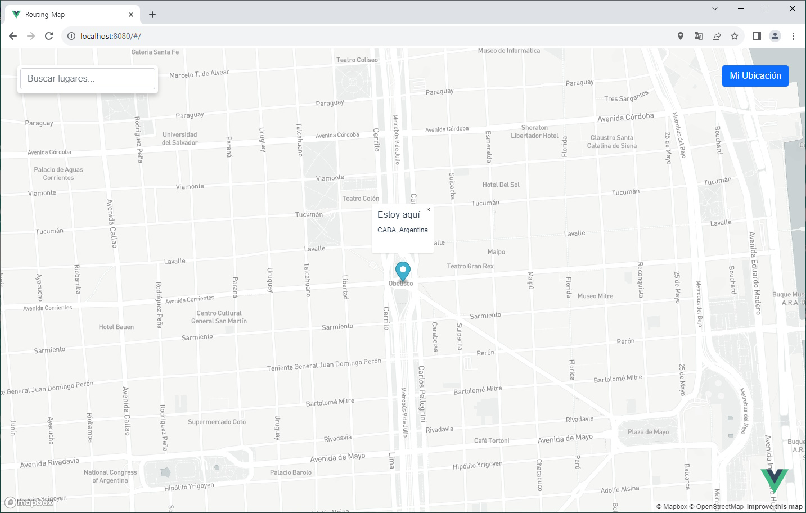
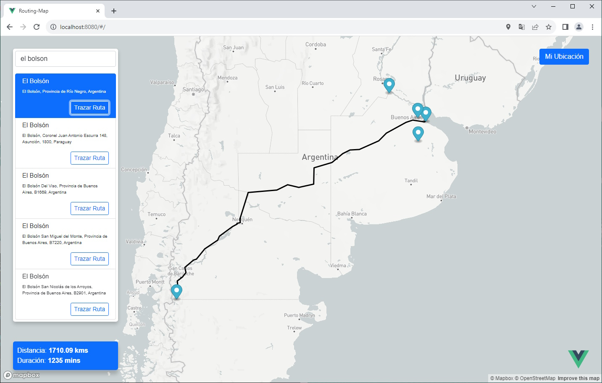
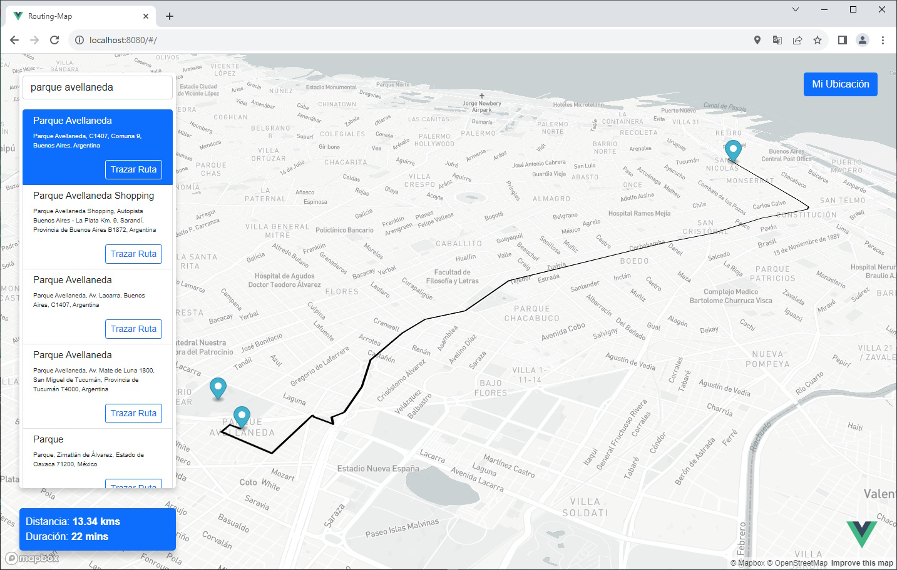

# Routing-Map

A Routing-Map app, developed in Vue 3 + Typescript 4 + Geoapify/MapBox mapping services.  
[LIVE DEMO HERE](https://andres-garcia-alves.github.io/demo-routing-map/)  

&nbsp;

Current functionality:  
- Find my location.
- Search locations by name.
- Routing between current location an any selected search location result.
- Route distance (in kilometers) and duration (in minutes).
- Maps 3D view.

Notes: This website uses device's geolocation to work.

&nbsp;

Based on Fernando Herrera's online Vue.js courses (spanish):  
- [YouTube channel](https://www.youtube.com/@DevTalles)  
- [Course: 'Vue.js: De cero a experto'](https://www.udemy.com/course/vuejs-fh/)  

&nbsp;

### Screenshots

| My location                           | Search locations                      |
|---------------------------------------|---------------------------------------|
|      |      |

| Routing                               | 3D view                               |
|---------------------------------------|---------------------------------------|
|      |      |

&nbsp;

### Project setup

If you want to run this project then you need [Node.js](https://nodejs.org) installed.

| Command          | Description                                                                          |
|------------------|--------------------------------------------------------------------------------------|
| `npm install`    | Install dependencies.                                                                |
| `npm run serve`  | Launch browser with the app.   Press `Ctrl+C` to stop **http-server** process.  |
| `npm run build`  | Build a minified app version for production.                                         |

&nbsp;

### Version History

v1.0 (2023.12.03) - Initial release.  
v1.1 (2023.12.29) - Adding Geoapify mapping support, changed WebPack to Vite.  
v1.2 (2026.01.30) - Adding CI/CD.  

&nbsp;

This source code is licensed under GPL v3.0  
Please send to me your feedback about this game: andres.garcia.alves@gmail.com
